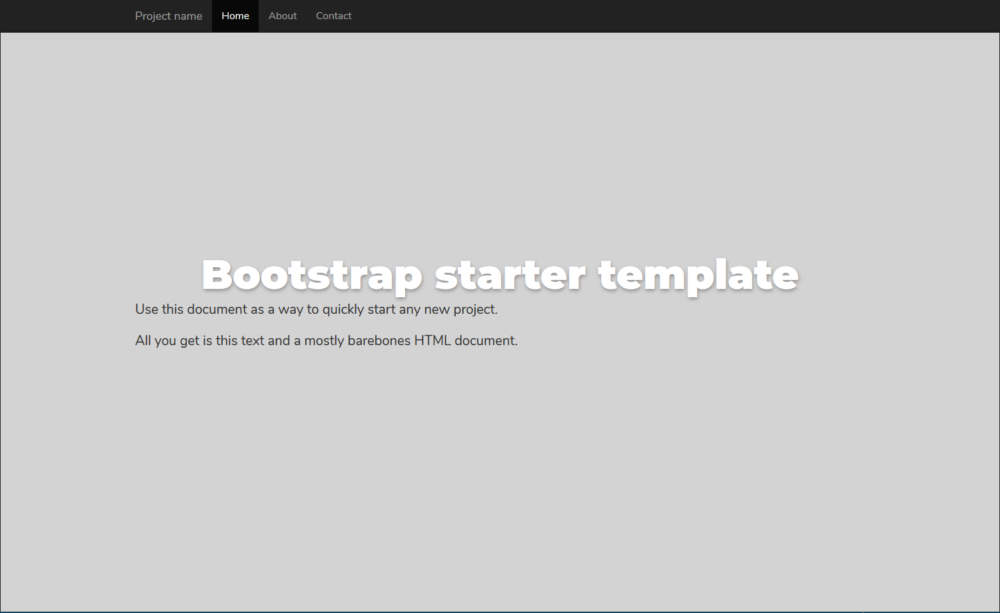

# Cogear.JS theme **bootstrap**




About this theme.

# Installation

Go to the site folder and install theme with command:
```bash
yarn add cogear-theme-bootstrap
# or 
npm install cogear-theme-bootstrap
```

After that you need to edit your site `config.yaml` to set up installed theme.

# Usage

Describe theme usage.

# Docs

More info: [https://cogearjs.org/docs/themes](https://cogearjs.org/docs/themes).